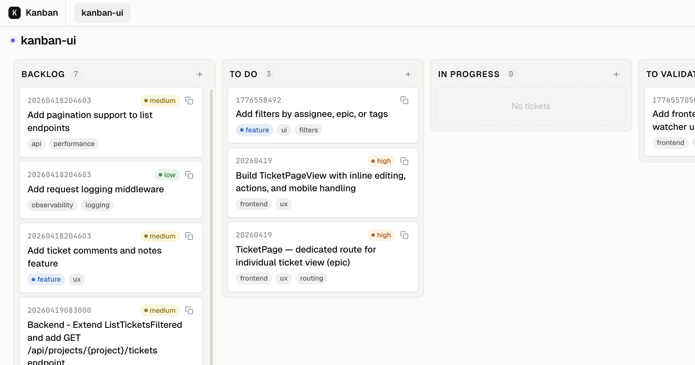

# goban

A single binary to view and edit a local kanban board from your browser.

[](https://go.dev)
[](https://github.com/GabrielVidal1/goban/pkgs/container/goban)
[](https://github.com/GabrielVidal1/goban/releases)
[](https://github.com/GabrielVidal1/goban/actions/workflows/docker.yml)
[](LICENSE)



---

## Features

- Drag-and-drop columns and tickets
- Multiple projects, each with their own column order
- Realtime sync via SSE — changes on disk reflect instantly in the browser
- Per-column `script.sh` for custom automation
- Single self-contained binary (UI embedded, no separate static files)
- Token-based auth with auto-generated token on first run

## Install

### Pre-built binary

Download the latest release for your platform from [GitHub Releases](https://github.com/GabrielVidal1/goban/releases), then:

```bash
chmod +x goban
./goban
```

### Docker

```bash
docker run -p 8080:8080 -v $(pwd)/kanban:/kanban \
  -e AUTH_TOKEN=your-secret \
  ghcr.io/GabrielVidal1/goban:latest
```

Or with docker-compose — copy `docker-compose.yml` from this repo, set `AUTH_TOKEN`, then:

```bash
docker compose up
```

### Build from source

Requires Go 1.24+ and Node 22+.

```bash
make build
./goban
```

## Usage

On first run, goban prints a URL with an embedded auth token:

```
http://localhost:8080/?token=abc123...
```

Open it in your browser. The token is saved to `localStorage` so you won't need it again on the same device.

### Configuration

Copy `.env.example` to `.env` and adjust as needed:

```env
KANBAN_DIR=./kanban   # where board data lives
PORT=8080
AUTH_TOKEN=           # leave blank to auto-generate on each start
```

Flags and environment variables override the `.env` file. Flags take highest precedence.

### Board layout

```
kanban/
  <project>/
    config.json        # column order
    <column>/
      <slug>.md        # ticket (YAML front matter + body)
      script.sh        # optional per-column automation
    _archive/          # hidden from the UI
```

### CLI

```bash
./goban tickets list <project>
./goban ticket create <project> <column> "My ticket"
./goban ticket move <project> <slug> "In Progress"
./goban ticket get <project> <slug>
./goban help
```

## Development

```bash
make dev     # starts Go (air) + Vite with HMR in parallel
             # open the Vite URL (not :8080) during UI work
```
